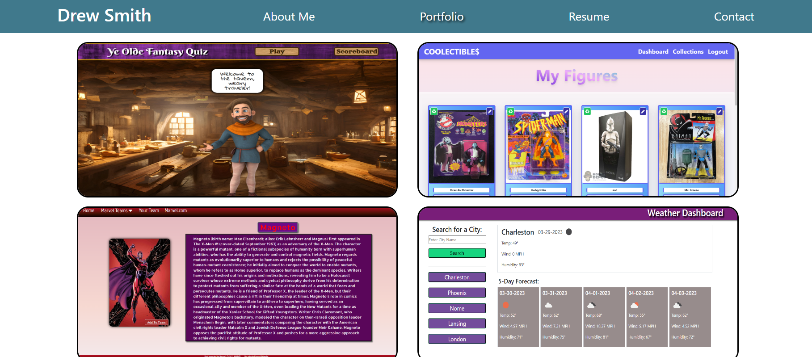

# React Portfolio

[Link to Live App]()

## Description
This single-page-app portfolio, created with React, displays About Me, Portfolio, Resume, and Contact me sections. 

## Screenshot

## Installation
* N/A

## Usage
* Navigate to the website. 
* The About Me section will load. 
* Click on the desired navigation link to load the desired component. 
* On the Portfolio page, the title should appear when hovering over the project photo. 
* To see the live project, click the project's title. 
* To see the repo for the project, click on the GitHub icon below the stack used. 
* On the Resume page, users can download my resume (sample doc) via the download link at the top. 
* On the Contact Me page, the name, email, and message are required elements. Users will receive an alert if these fields are left with invalid responses. 

## References
* Referenced Activity 24 from Unit 20
* Referenced Mini Project code from Unit 20
* Assistance from the instructor
* [For project overlay/animation](https://www.youtube.com/watch?v=exb2ab72Xhs)
* [For email Regex](https://www.w3resource.com/javascript/form/email-validation.php)
* [For on-blur and email testing](https://www.codingdeft.com/posts/react-onblur-onchange/)

## License
Please refer to the license in the repo.
- - -